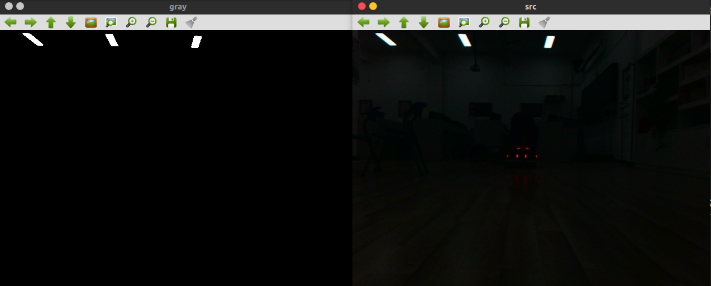
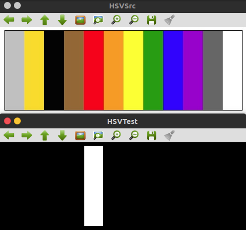
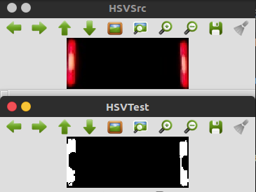
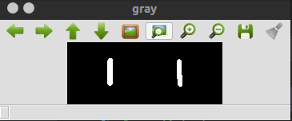
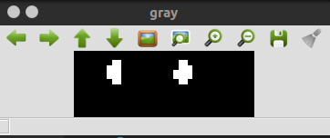

# 1. RoboMaster装甲识别技术报告
<!-- TOC -->

- [1. RoboMaster装甲识别技术报告](#1-robomaster装甲识别技术报告)
    - [1.1. 任务分解](#11-任务分解)
        - [1.1.1. 找出合适的二值图](#111-找出合适的二值图)
            - [1.1.1.1. 关于为什么不使用大津法以及adaptiveThreshould](#1111-关于为什么不使用大津法以及adaptivethreshould)
            - [1.1.1.2. 选择二值图的时候区分红蓝装甲](#1112-选择二值图的时候区分红蓝装甲)
            - [1.1.1.3. 保证装甲的灯条信息不被破坏](#1113-保证装甲的灯条信息不被破坏)
            - [1.1.1.4. 装甲距离过远导致图像特征改变的应对策略](#1114-装甲距离过远导致图像特征改变的应对策略)
        - [1.1.2. 检测装甲块，将信息传给角度解算部分](#112-检测装甲块将信息传给角度解算部分)
            - [1.1.2.1. 检测轮廓的效率保证](#1121-检测轮廓的效率保证)
            - [1.1.2.2. 对单个轮廓的筛选策略](#1122-对单个轮廓的筛选策略)
            - [1.1.2.3. 对于轮廓匹配的筛选策略](#1123-对于轮廓匹配的筛选策略)
            - [1.1.2.4. 检测无装甲的处理](#1124-检测无装甲的处理)
            - [1.1.2.5. 确定传输的数据格式](#1125-确定传输的数据格式)
    - [1.2. 整体架构](#12-整体架构)
        - [1.2.1. 从用户的角度分析](#121-从用户的角度分析)
        - [1.2.2. 从开发者的角度分析](#122-从开发者的角度分析)
    - [1.3. 性能优化](#13-性能优化)
        - [1.3.1. 当目标不消失的时候进行局部检测，以便提高检测效率](#131-当目标不消失的时候进行局部检测以便提高检测效率)
        - [1.3.2. 将图片的读取和处理分开](#132-将图片的读取和处理分开)
    - [1.4. 补充说明](#14-补充说明)
    - [1.5. 遗留问题](#15-遗留问题)
        - [1.5.1. 摄像头所得到的装甲区域颜色问题](#151-摄像头所得到的装甲区域颜色问题)
        - [1.5.2. 当检测装甲错误的时候，没有处理的策略](#152-当检测装甲错误的时候没有处理的策略)
        - [1.5.3. 图片质量无法保证](#153-图片质量无法保证)

<!-- /TOC -->
## 1.1. 任务分解

### 1.1.1. 找出合适的二值图
> 因为考虑到硬件的性能和环境的复杂程度，我们所有的任务都是处于曝光为-9的条件下完成，既能进行识别，也能减少噪音。  

#### 1.1.1.1. 关于为什么不使用大津法以及adaptiveThreshould
> 主要是一次偶尔的发现，因为我们在曝光为-9的条件下做识别任务，所以图像的亮度是一个很大的问题，我们装甲所处的环境是舍内，我们对比发现，舍内的灯条亮度会影响到装甲的灯条信息，加之考虑硬件性能，我们没有选择这两种做法
- 当使用CV_THRESH_OTSU时，很明显，灯条颜色非常明显的时候就被筛掉了，而天花板的灯条却非常清晰，说明在曝光为-9的情况下使用这个方法是不恰当的。



- 同理，我们使用adaptiveThreshold会有同样的问题，同时会导致处理速度变慢，所以我们不采用这两种方式。  

#### 1.1.1.2. 选择二值图的时候区分红蓝装甲
> 在进行装甲识别进行自瞄的时候，如何区分敌我双方是最基础也是最重要的一个问题。为了让我方机器人顺利检测到敌方的装甲，我们使用了HSV格式进行颜色的识别，因为HSV格式的色彩敏感度是非常优秀的。
- 关于蓝色和红色在HSV中的具体范围，请参考[HSV基本颜色分量范围](http://img.blog.csdn.net/20160526141816845?watermark/2/text/aHR0cDovL2Jsb2cuY3Nkbi5uZXQv/font/5a6L5L2T/fontsize/400/fill/I0JBQkFCMA==/dissolve/70/gravity/Center)，当然我们想象的过于简单了。当我们考虑到具体的硬件条件，比如**摄像头性能**，**灯条颜色的范围**，仅仅用上面的方法根本无法做到区分敌我双方，反而可能损失灯条的有效信息，造成识别精度下降。
---
下图是简单的应用HSV识别红色的部分:  

  

使用相同的HSV范围，然而实际效果却是这样：  

  

可见，正是因为HSV的敏感性，我们在使用的时候反而需要扩大HSV的选取范围。以便不丢失任何信息，由于红色和蓝色正好是对比色， 在OpenCv里的HSV，[H范围是0-180](http://img.blog.csdn.net/20160526140055291?watermark/2/text/aHR0cDovL2Jsb2cuY3Nkbi5uZXQv/font/5a6L5L2T/fontsize/400/fill/I0JBQkFCMA==/dissolve/70/gravity/Center)，我们把颜色划分为三部分，其中蓝色为90-150，红色为0-30以及150-180。 所以在选择上我们可以放心的扩大范围而不用担心二者重合。

#### 1.1.1.3. 保证装甲的灯条信息不被破坏
> 主要针对红色装甲的识别来说，我们需要[使用|操作来获取完整的红色分割区域](https://solarianprogrammer.com/2015/05/08/detect-red-circles-image-using-opencv/)。
- 因为HSV的分布空间中，红色是在两边的，所以我们进行如下操作：
```c++
if (enemy_is_red)
{
    cv::Mat threshouldImg0, threshouldImg1;
    cv::inRange(hsvImg, cv::Scalar(0, 0, 0), cv::Scalar(30, 255, 255), threshouldImg0);
    cv::inRange(hsvImg, cv::Scalar(150, 0, 0), cv::Scalar(180, 255, 255), threshouldImg1);
    cv::bitwise_or(threshouldImg0, threshouldImg1, threshouldImg);
}
else
{
    cv::inRange(hsvImg, cv::Scalar(90, 0, 10), cv::Scalar(150, 255, 255), threshouldImg);
}
```
这样保留了红色的信息，又和蓝色的识别区分开来  

#### 1.1.1.4. 装甲距离过远导致图像特征改变的应对策略
> 摄像头的识别距离是有限的，当灯条变得非常远的时候，往往会损失它的特征，我们要做的就是尽量恢复灯条的特征，以便进行识别。
- 正常灯条轮廓：



- 远距离情况下灯条轮廓：  

  

- 由上述两种情况可见，我们必须恢复图像在远距离情况下的特征，进行下面的操作可以得到恢复特征后的图像：  
```c++
if (detector.lastboard_rect.area() < 1300)
{
    detector.too_far = true;
    // dilate(regImg, regImg, kernel);
    erode(regImg, regImg, kernel);
    resize(regImg, regImg, cv::Size(), 1.0, 4.0);

    regImg = regImg > 1;
}
```
这里我们将图像竖直拉伸了四倍，关于性能的问题我们将在1.3的部分讨论，恢复后的图像如下所示：  

  


### 1.1.2. 检测装甲块，将信息传给角度解算部分
> 我们肯定不能把findContours所有轮廓逐个匹配，那样程序是不可能在妙算上完成的，我们采用比较简单的思路：1.筛掉不符合条件的单个轮廓。2.筛掉不符合条件的匹配灯条

#### 1.1.2.1. 检测轮廓的效率保证
- 双重筛选，当轮廓很少时，几乎可以做到和逐个匹配一样的效果，但是复杂度降低到O(n)
- 考虑到噪音的数量远比轮廓的多，并且筛选的条件很多，我们采用非常高效简单的单个轮廓筛选方法，然后针对剩下的轮廓，采用匹配算法来找出可能性最大的装甲灯条。  

#### 1.1.2.2. 对单个轮廓的筛选策略
```c++
// 第一轮筛选
for (int i = 0; i < contours.size() && contours.size() > 2; ++i)
{
    //if contour.size<5, eillpse cannot be used
    if (contours[i].size() < 5)
        continue;

    //然后根据轮廓的角度，筛掉那些不满足垂直方向角度偏移
    RotatedRect minRect = fitEllipse(contours[i]);
    minRect = detector.adjustRRect(minRect);

    auto angle = minRect.angle;
    angle = 90 - angle;
    angle = angle < 0 ? angle + 180 : angle;
    if (std::abs(angle - 90) > 30)
        continue;
    final_contours.push_back(contours[i]);
}
```

#### 1.1.2.3. 对于轮廓匹配的筛选策略
- 我们对于匹配考虑的比较严谨，因为对于每一对匹配，我们会将其投影到正视图并且计算其结构相似度。
```c++
// 目前得到的contours是比较符合灯条形状的final_contours,接下来就是分别连接这些contour，判断形成的准装甲板是否符合一定条件
for (int i = 0; i < final_contours.size(); ++i)
{
    RotatedRect rRect1 = cv::minAreaRect(final_contours[i]);
    rRect1 = detector.adjustRRect(rRect1);

    vector<cv::Point> pos_1;
    detector.getTarget2dPoinstion(rRect1, pos_1);

    Point2f mid_u1, mid_d1;
    // 隐藏了部分代码
    auto angle_1 = atan2(mid_d1.y - mid_u1.y, mid_d1.x - mid_u1.x) * 180 / CV_PI;

    for (int j = i + 1; j < final_contours.size(); ++j)
    {

        RotatedRect rRect2 = cv::minAreaRect(final_contours[j]);
        vector<cv::Point> pos_2;
        rRect2 = detector.adjustRRect(rRect2);
        detector.getTarget2dPoinstion(rRect2, pos_2);
        Point2f mid_u2, mid_d2;
        // 隐藏了部分代码
  
        auto angle_2 = atan2(mid_d2.y - mid_u2.y, mid_d2.x - mid_u2.x) * 180 / CV_PI;
        // 比较装甲是否水平的
        if (std::abs(angle_1 - angle_2) > 5)
            continue;

        // current board
        RotatedRect board = detector.boundingRRect(rRect1, rRect2);
        // 隐藏部分代码

        // 角度筛选
        double angle = 0;
        if (pos_2[1].x != pos_1[2].x)
            angle = std::atan2(pos_1[2].y - pos_2[1].y, pos_2[1].x - pos_1[2].x);
        if (angle > 5)
            continue;

        //长宽筛选
        auto width = POINT_DIST(pos_board[0], pos_board[1]);
        auto height = POINT_DIST(pos_board[0], pos_board[2]);
        auto rate = width / height;
        if (rate > 3.2 || rate < 0.1)
            continue;

        // 保证安全
        Mat dst;
        Point2f roi[4] = {pos_board[0], pos_board[1], pos_board[2], pos_board[3]};
        if (!detector.makeBoxSafe(roi))
            continue;

        detector.perspectiveTransformation(srcImage, dst, roi, Size(105, 44));

        // BGR for the default, choose channel 2
        // 使用MSSIM进行评价
        double dist = 0;
        dist = (detector.enemy_is_red ? (detector.getMSSIM(dst))[2] : (detector.getMSSIM(dst))[0]);


        // for run_time value: this value ma be wrong, could not as mainly factor
        if (dist > 0.34)
        {
            armors_pos.emplace_back(dist, board, board_position);
        }
    }
}
```
- 我们通过两重筛选，将符合装甲条件的存入**armors_pos**里面，其中dist是调用MSSIM的评测结果，值大的相似，调用排序函数可以得到最相似的一个装甲块:  
```c++
// use sort to find the best position
sort(armors_pos.begin(), armors_pos.end(), [](ArmorPos a, ArmorPos b) { return a.diff > b.diff; });
```
#### 1.1.2.4. 检测无装甲的处理
> 我们的装甲检测部分很可能一个装甲都检测不到，因为前面的条件可能过于严苛，或者这一帧真的没有东西需要检测。所以当检测不到装甲的时候，我们有以下策略：  
- 记录一次loss
- 返回一个空的装甲索引给角度解算
- 当loss大于某个值，进行全局检测（这是1.3中的内容)  
```c++
// wait for 10 fps
if (detector.loss_count < 10)
{
    ++detector.loss_count;
}
else
{
    detector.loss_count = 0;
    detector.too_far = false;
    detector.lastboard_rect = cv::Rect(0, 0, 640, 480);
}
```
#### 1.1.2.5. 确定传输的数据格式
> 我们一开始返回旋转矩形给角度解算，其实是不精确的，在此版本中，我们把检测到的装甲的两个灯条的上下点返回给角度解算  
```c++
vector<cv::Point2f> chooseTarget(Mat &srcImage, ArmorDetector &detector);
```
## 1.2. 整体架构
> 这里将从实用性以及扩展性进行介绍

### 1.2.1. 从用户的角度分析  

- 只留出一个函数供角度解算使用，便于操作。
即我们在装甲检测这个类只留出了一个**chooseTarget**函数供用户使用，当程序出错的时候，便于检测问题出在哪里。  

### 1.2.2. 从开发者的角度分析
- 提供的资源及其有限，不得不考虑在仅仅一个函数的生命周期的情况下保证资源的重复使用，受到了不少限制。
- 便于独立开发，不受其余部分的干扰。

## 1.3. 性能优化  

### 1.3.1. 当目标不消失的时候进行局部检测，以便提高检测效率
```c++
private:
    // 该成员是上一帧的运行状况，我们使用其二倍大小来在其周围检测当前帧的装甲
    cv::Rect lastboard_rect;
----------------------------------------
    detector.updatePosInfo(final_board);
----------------------------------------
// 更新下一帧应该处理的装甲位置
void ArmorDetector::updatePosInfo(const ArmorPos &armor)
{
	if (!too_far)
	{
		cv::Rect rec = armor.rRect.boundingRect();
		rec += rec.size();
		Point p = cv::Point(rec.width * 0.25, rec.height * 0.25);
		rec -= p;
		if (rec.x < 0)
			rec.x = 0;
		if (rec.y < 0)
			rec.y = 0;
		if (rec.x + rec.width > 640)
			rec.x = 640 - rec.width;
		if (rec.y + rec.height > 480)
			rec.y = 480 - rec.height;
		this->lastboard_rect = rec;
	}
	else
	{
		// we use 1*4 size of src
		Point2f center;
		for (auto p : armor.Pos)
			center += p;
		center /= 4; // center of the armor

		cv::Rect rec(center - Point2f(20, 10), center + Point2f(20, 10));
		if (rec.x < 0)
			rec.x = 0;
		if (rec.y < 0)
			rec.y = 0;
		if (rec.x + rec.width > 640)
			rec.x = 640 - rec.width;
		if (rec.y + rec.height > 480)
			rec.y = 480 - rec.height;
		this->lastboard_rect = rec;
	}
}
```
### 1.3.2. 将图片的读取和处理分开  

- 读取和处理是分开的，通过加一个图片缓冲区来实现  

## 1.4. 补充说明  

- 此版本在妙算上处理58秒25帧每秒的视频，不使用imshow可以达到63帧每秒，使用imshow可以达到43每秒。
- [对于视频的处理效果](result.flv)  
- 其中红色区域是lastboard_rect的范围，形成的绿色线条是左右灯条四个端点。  

## 1.5. 遗留问题  

### 1.5.1. 摄像头所得到的装甲区域颜色问题
- 由于摄像头的分辨率理想情况下是1920*1080，此时所得到的装甲是红色或者蓝色的，当直接使用640*480去处理图片的时候，得到的是白色的灯条，很难处理
- 暂时是将高分辨率的视频流resize成低分辨率，保留装甲灯条的视频信息

### 1.5.2. 当检测装甲错误的时候，没有处理的策略
- 当装甲识别检测到了不应该检测的灯条，除了操作手，无法告诉检测代码停止检测错误装甲。  

### 1.5.3. 图片质量无法保证  
